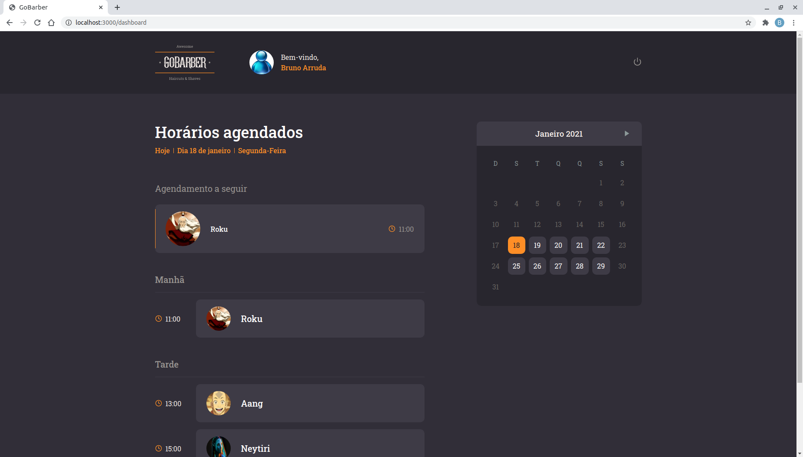
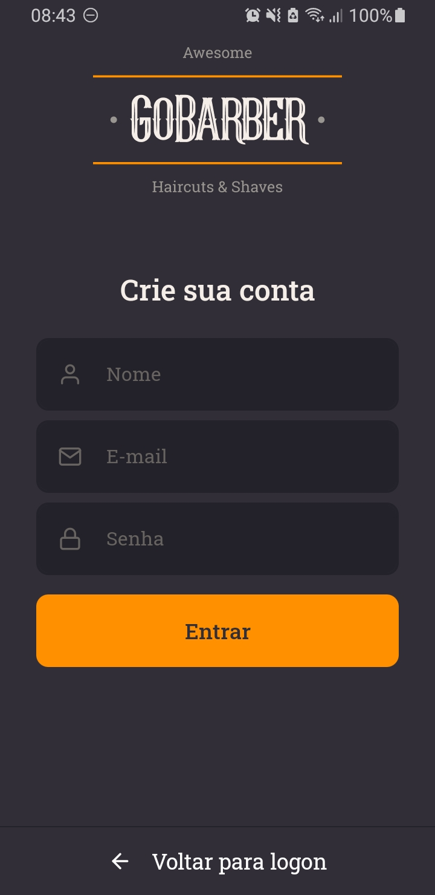

<h1 align="center">
    
    
</h1>

[Sobre](#Sobre) - [Funcionalidades](#Funcionalidades) - [Tecnologias utilizadas](#Tecnologias-utilizadas) - [Como baixar o projeto](#Como-baixar-o-projeto) - [Screenshots](#Screenshots)

<p align="middle">
  
  
</p>

---

## Sobre

### Durante o curso GoStack foi desenvolvida a aplicação GoBarber (Back-end, Front-end e Mobile), para mostrar e fixar os conteúdos ensinados na prática.

---

## Funcionalidades

### Versão web

- Cadastro dos usários.
- Autenticação na aplicação pelos usuários.
- Tela para esqueci minha senha.
- Tela para alteração dos dados, senha e foto do usuário.
- Dashboard para visualização dos agendamentos com navegação por dia.
- Mensagens de sucesso, erro e informativas em forma de toast.

### Versão mobile

- Cadastro dos usários.
- Autenticação na aplicação pelos usuários.
- Tela para alteração dos dados, senha e foto do usuário.
- Dashboard para realização de um novo agendamento com seleção do cabeleireiro, data e horário disponíveis e confirmação do agendamento.

---

## Tecnologias utilizadas

O projeto foi desenvolvido utilizando as seguintes tecnologias

Backend

- [node](https://nodejs.org/en/)
- [aws-sdk](https://www.npmjs.com/package/aws-sdk)
- [bcryptjs](https://www.npmjs.com/package/bcryptjs)
- [celebrate](https://github.com/arb/celebrate)
- [class-transformer](https://github.com/typestack/class-transformer)
- [cors](https://www.npmjs.com/package/cors)
- [date-fns](https://date-fns.org/)
- [dotenv](https://www.npmjs.com/package/dotenv)
- [express](https://expressjs.com/pt-br/)
- [express-async-errors](https://www.npmjs.com/package/express-async-errors)
- [handlebars](https://handlebarsjs.com/)
- [ioredis](https://github.com/luin/ioredis)
- [jsonwebtoken](https://www.npmjs.com/package/jsonwebtoken)
- [mime](https://www.npmjs.com/package/mime)
- [mongodb](https://www.npmjs.com/package/mongodb)
- [multer](https://www.npmjs.com/package/multer)
- [nodemailer](https://nodemailer.com/about/)
- [prate-limiter-flexibleg](https://github.com/animir/node-rate-limiter-flexible)
- [redis](https://www.npmjs.com/package/redis)
- [reflect-metadata](https://www.npmjs.com/package/reflect-metadata)
- [tsyringe](https://www.npmjs.com/package/tsyringe)
- [typeorm](https://typeorm.io/#/)
- [uuid](https://www.npmjs.com/package/uuid)

Web

- [react](https://pt-br.reactjs.org/)
- [@testing-library/jest-dom](https://testing-library.com/docs/react-testing-library/intro/)
- [@testing-library/react](https://testing-library.com/docs/react-testing-library/intro/)
- [@testing-library/user-event](https://testing-library.com/docs/react-testing-library/intro/)
- [@unform/core](https://unform.dev/)
- [@unform/web](https://unform.dev/)
- [axios](https://github.com/axios/axios)
- [date-fns](https://date-fns.org/)
- [react-day-picker](https://react-day-picker.js.org/)
- [react-dom](https://pt-br.reactjs.org/docs/react-dom.html)
- [react-icons](https://react-icons.github.io/react-icons/)
- [react-router-dom](https://reactrouter.com/web/guides/quick-start)
- [react-scripts](https://www.npmjs.com/package/react-scripts)
- [react-spring](https://www.react-spring.io/)
- [styled-components](https://styled-components.com/)
- [uuid](https://www.npmjs.com/package/uuid)
- [web-vitals](https://www.npmjs.com/package/web-vitals)
- [yup](https://github.com/jquense/yup)

Mobile 

- [react-native](https://reactnative.dev/)
- [@react-native-community/async-storage](https://www.npmjs.com/package/@react-native-community/async-storage)
- [@react-native-community/datetimepicker](https://github.com/react-native-datetimepicker/datetimepicker)
- [@react-native-community/masked-view](https://www.npmjs.com/package/@react-native-community/masked-view)
- [@react-navigation/native](https://reactnavigation.org/)
- [@react-navigation/stack](https://reactnavigation.org/)
- [@unform/core](https://unform.dev/)
- [@unform/mobile](https://unform.dev/)
- [axios](https://github.com/axios/axios)
- [date-fns](https://date-fns.org/)
- [react](https://pt-br.reactjs.org/)
- [react-native-gesture-handler](https://github.com/software-mansion/react-native-gesture-handler)
- [react-native-image-picker](https://github.com/react-native-image-picker/react-native-image-picker)
- [react-native-iphone-x-helper](https://github.com/ptelad/react-native-iphone-x-helper)
- [react-native-reanimated](https://www.npmjs.com/package/react-native-reanimated)
- [react-native-safe-area-context](https://www.npmjs.com/package/react-native-safe-area-context)
- [react-native-screens](https://github.com/software-mansion/react-native-screens)
- [react-native-vector-icons](https://github.com/oblador/react-native-vector-icons)
- [styled-components](https://styled-components.com/)
- [yup](https://github.com/jquense/yup)
- [react-native-testing-library](https://github.com/callstack/react-native-testing-library)

---

## Como baixar o projeto

```bash
  
  # Clonar o repositório
  git clone https://github.com/brunoOGA/GoBarber.git
  
```

### Configurações necessárias

- Git
- Docker
- Node
- Yarn
- Ambiente para desenvolvimento mobile configurado

### Backend

```bash

# Criando serviço de banco de dados postgres
docker run --name gostack_postgres -e POSTGRES_PASSWORD=postgres -p 5432:5432 -d postgres

# cCriando serviço de banco de dados mongo
docker run --name mongodb -p 27017:27017 -d -t mongo

# Criando serviço de banco de dados redis
docker run --name redis -p 6379:6379 -d -t redis:alpine

# Iniciando os serviços de banco de dados
docker start gostack_postgres mongodb redis

```

Crie o arquivo <b>.env</b>, seguindo o <b>.env.example</b>.

```bash 
# Entrar no diretório
cd backend

# Instalar as dependências
yarn 

# Executando as migrations
yarn typeorm migration:run

# Iniciar o servidor
yarn dev:server
```

### Frontend

```bash
# Entrar no diretório
cd frontend

# Instalar as dependências
yarn

# Iniciar o frontend
yarn start

```

### Mobile

Abra o emulador ou conecte um dispositivo físico.

```bash
# Entrar no diretório
cd mobile

# Instalar as dependências
yarn

# Iniciar o mobile
yarn start

# Em outro terminal execute o comando
yarn android
```

---

## Screenshots

### Versão web

<p align="middle">
  
  
  
  
</p>

---

### Versão mobile

<p align="middle">
  
  
  
  
  
  
</p>

---

 ### Backend

 <p align="middle">
  
</p>
